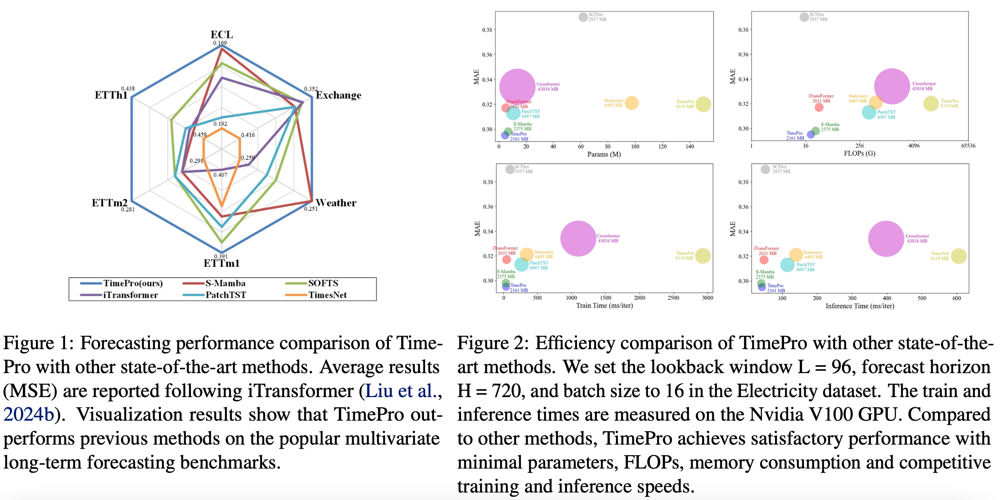
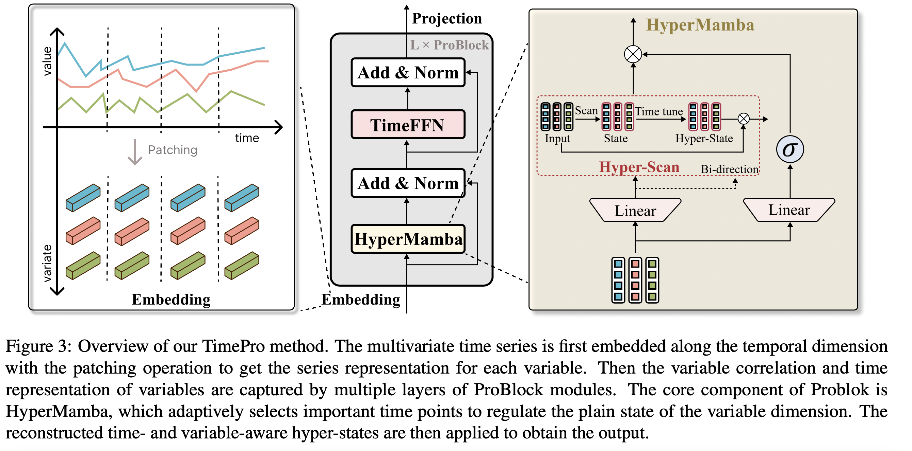
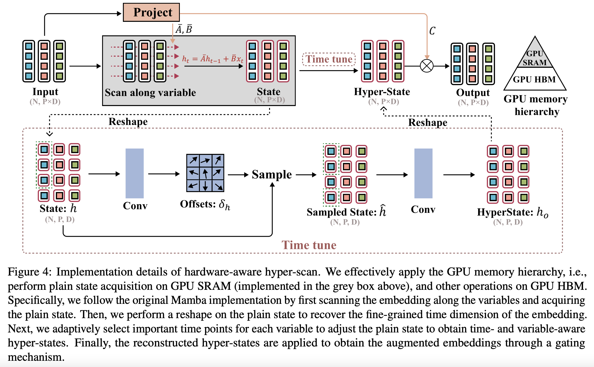
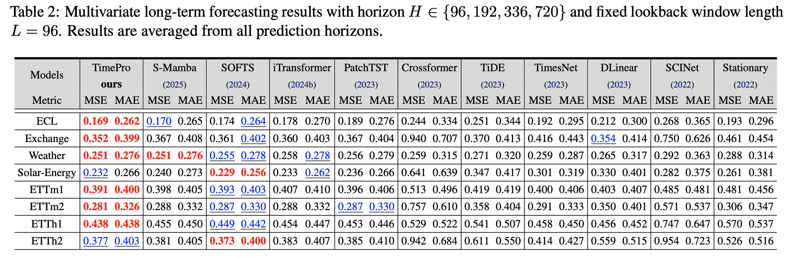

<div align="center">
<h1>TimePro </h1>
<h3>TimePro: Efficient Multivariate Long-term Time Series Forecasting with
Variable- and Time-Aware Hyper-state</h3>
 
[Xiaowen Ma](https://scholar.google.com/citations?hl=zh-CN&user=UXj8Q6kAAAAJ)<sup>1</sup>, Zhenliang Ni<sup>1</sup>, Shuai Xiao, Xinghao Chen<sup>1</sup>

<sup>1</sup> Huawei Noah’s Ark Lab

 [[Paper Link]()]

</div>

## 🔥 News
- **`2025/05/24`**: **Code for TimePro is available.**


## 📷 Introduction

### 1️⃣ A powerful and efficient multivariate time series forecasting model



### 2️⃣ Architecture





### 3️⃣ Performance



## 📚 Use example

- Environment

  ```shell
  conda create --name timepro python=3.9 -y
  conda activate timepro
  pip install -r requirements.txt
  cd selective_scan && pip install .
  ```

- Dataset

  The dataset can be download at this [link](https://github.com/xwmaxwma/TimePro/releases/download/dataset/TimePro_dataset.zip)
  ```shell
  ln -s /path/to/TimePro_dataset/ dataset
  ```

- Train

  ```shell
  bash scripts/TimePro_ECL.sh
  bash scripts/TimePro_Exchange.sh
  bash scripts/TimePro_SolarEnergy.sh
  bash scripts/TimePro_Weather.sh
  bash scripts/TimePro_ETTh1.sh
  bash scripts/TimePro_ETTh2.sh
  bash scripts/TimePro_ETTm1.sh
  bash scripts/TimePro_ETTm2.sh
  ```


## 🌟 Citation

If you are interested in our work, please consider giving a 🌟 and citing our work below.

```
@inproceedings{
timepro,
title={TimePro: Efficient Multivariate Long-term Time Series Forecasting with Variable- and Time-Aware Hyper-state},
author={Anonymous},
booktitle={Forty-second International Conference on Machine Learning},
year={2025},
url={https://openreview.net/forum?id=s69Ei2VrIW}
}
```


## 💡Acknowledgment

Thanks to previous open-sourced repo:

[S-Mamba](https://github.com/wzhwzhwzh0921/S-D-Mamba), [VMamba](https://github.com/MzeroMiko/VMamba), [Spatial-Mamba](https://github.com/EdwardChasel/Spatial-Mamba)

